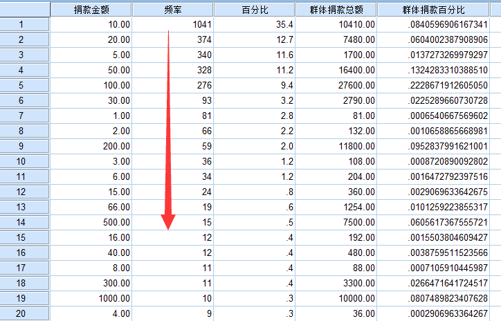

# 分析报告

## 基本统计

- 开始时间是：10月28日23点
- 截止到统计时间：11月4日16点

- 总捐款金额：123840.57 元
- 有 2939 个人参与捐款
- 大部分人捐款 10 元
- 人均捐款 42 元
- 捐款最少值是 1 元
- 捐款最多是 10000 元

## 单位时间统计

##### 每小时的捐款人数

整体来看

- 开始有两个比较明显的起伏，之后的起伏差距不是特别明显
- 趋势是不断下降的，逐渐平滑，趋于0

上图有几个比较明显的低谷

- 10.30 2h-5h
- 10.31 2h-5h
- 11.01 1h-6h

这些时间段是睡觉时间，所以很少有人刷空间或朋友圈，因此捐款人数也非常少，不过还是有极少量的夜猫子

下面的结论不包含每天的1:00-6:00，这段时间属于睡觉时间，活跃人数相对较少

- 扩散到社交媒体的第一天，每小时的捐款人数基本都在50人以上，最高是10点158人
- 第二天基本都在20人以上，最多大概是60人
- 第三天基本都在10人以上，最多大概是25人

------

##### 每小时捐款的最大值

我把图中的三个顶点的具体信息找了出来，他们对接下来的每小时捐款总和、平均值，都有较大影响

- 2016/10/29 23:44:14 用户432625935 捐款 5000 元
- 2016/10/30 11:37:39 用户432850757 捐款 2000 元
- 2016/10/31 21:24:23 用户434008706 捐款 10000 元

---

##### 每小时的捐款总额

从上图我们可以看出有 3 个特别突出的，超过了 6000

- 10.29 23h
- 10.30 12h
- 10.31 21h

第一个和第二个比较好理解。从时间点上我们可分析，解释如下：

- 从10.29号23点左右，开始传播并引爆社交媒体，所以形成第一个高峰。这个时间一些人还是没有睡觉的，并且他们都是与当事人有直接关系的，是当事人的朋友，他们是传播的第一层级。
- 紧接着进入睡觉时间，所以捐款的人就非常少了。
- 第二天上午再次引爆社交媒体，一部分是昨晚没有看到，更多的是第二层级的受众，即当事人朋友的朋友。
- 第二天晚饭时间又有一个小高峰，应该是第二层级受众和第三层级受众
- 再后来有一个异常值：1万元，所以特别明显，但那时的捐款人数并没有前两天多

---

##### 每小时捐款的平均值

- 虽然31号捐款的人数非常多，但大部分都是同学，所以经济能力有限
- 特别突出的点是因为1万的极大值

---

## 趋势统计

##### 随时间发展，捐款总人数的累计

由上图可以看出：捐款总人数已增长乏力，我再补充一下最近两天的每小时具体捐款人数

- 除了3号的8:00、13:00、19:00、21:00，早中晚、夜宵的饭点，其他捐款人数都是10人以下，同时，即使这4个时间点，也没有超过20人
- 4号，截止到下午16点30分，每小时捐款人数没有超过5人

---

##### 随时间发展，捐款总额的累计

图中3个红色矩形圈住的是前三天的捐款总额增长趋势，不包含每天的睡觉时间

- 前三天的增速是非常明显的
- 增速是随时间逐渐放缓的
- 第四天开始增速越来越平滑
- 今后的增长将会越来越少

---

## 群体分析

我把捐款同样金额的作为一个群体。例如：`RMB_100` 代表捐款100元的群体

##### 人数排名 top20

> Tip: 看不清可以横屏

---

##### 影响力排名 top20

例如：`RMB_100`群体捐款总额 = 100 * 捐款10元的总人数，

他们的捐款在总捐款的占比 = `RMB_100`群体捐款总额 / 所有捐款总额

> Tip: 看不清可以横屏

---

## 二八定律

二八定律，又叫帕累托定律，80/20定律。它的内容是：社会上20%的人占用80%的社会总财富，而80%的人只拥有20%的社会总财富。

我们假定：大家献爱心捐款都是在力所能及的范围，所以，捐款的金额和他的收入或者说财富是成正比关系的。

##### 25.48% 的人捐了 79.78% 的钱

从捐款 1万元 到 50元，这些人占总人数的 25.48%，但他们的捐款总额占比 79.78%

---

##### 74.51% 的人捐了 20.21% 的钱

从捐款 45元 到 1元，这些人占总人数的 74.51%，但他们的捐款总额只占 20.21%
